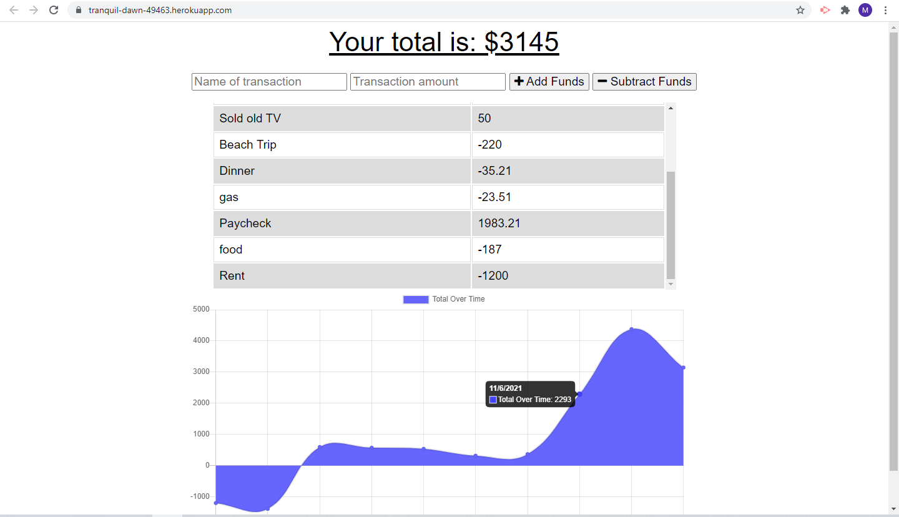

 
  # Budget Tracker
  

  ## Table of Contents
  * [Description](#description)
  * [Install](#install)
  * [Use](#use)
  * [License](#license)
  * [Contributing](#contributing)
  * [Tests](#tests)
  * [Questions](#questions)

  ## Description
  This app allows a user to track monetary expenses over time by inputting a description and monetary amount to be added or subtracted from the account. The app uses IndexedDB and cache methods to store information so that the app may be used with limited or no internet connectivity.
      

   [click here for deployed website](https://tranquil-dawn-49463.herokuapp.com/)

  ## Install
  Download the project files and use the command 'npm install' to install the appropriate node packages.
  
  ## Use
  After installing the the appropriate packages, use the command 'npm start' to initiate the server at http://localhost:3001/ and input budget expenses to generate a list and graph.
  
  ## License
  No license.

  ## Contributing
   

  ## Tests
  No tests were generated for this app.
  
  ## Questions
  - [Github for mattersievers](http://www.github.com/mattersievers)
  - For further questions, contact me through email at mattersievers@gmail.com

